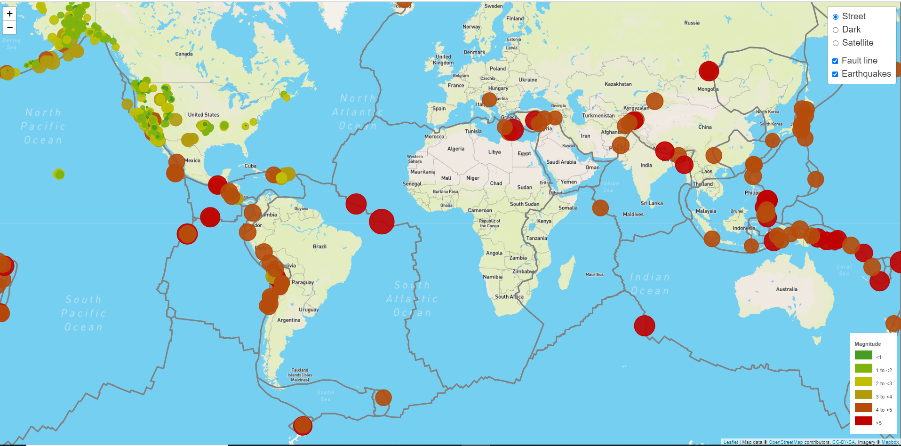

# Leaflet Challenge - Visualizing Data with Leaflet

## Background

I developed a dashboard using leaflet to visualize USGS earthquake data. The USGS is responsible for providing scientific data about natural hazards, the health of ecosystems and environment; and the impacts of climate and land-use change. They collect a massive amount of data from all over the world each day. 

### Basic Visualization

1. **Data source**

   The USGS provides earthquake data in a number of different formats, updated every 5 minutes. Visit the [USGS GeoJSON Feed](http://earthquake.usgs.gov/earthquakes/feed/v1.0/geojson.php) page to learn more.

   

2. **Import & Data Visualization**

   Created a map using Leaflet that plots all of the earthquakes from data set (last seven days) based on their longitude and latitude.

   * Data markers reflect the magnitude of the earthquake in their size and color.

   * Popup that provide additional information about the earthquake when a marker is clicked.

   * Created a legend that will provide context for the map data.

- - -

### Additional data and functionality

An additional GeoJSON was used to illustrate the relationship between tectonic plates and seismic activity. Data on tectonic plates can be found at <https://github.com/fraxen/tectonicplates>.

* Ploted a second data set on the map.

* Added a number of base maps to choose from as well as separate out  two different data sets into overlays that can be turned on and off independently.

* Add layer controls to the map.

- - -

